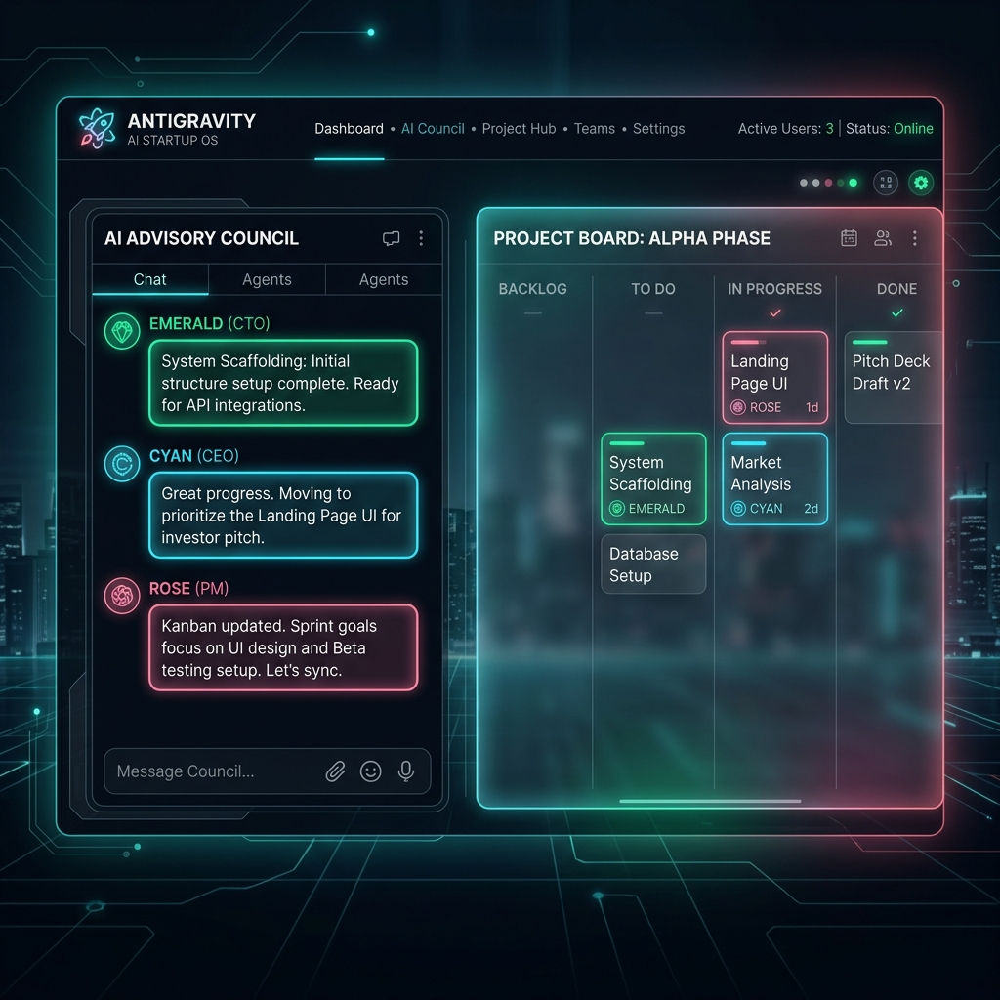

# 🌌 Antigravity AI Startup OS
### *A Multi-Agent Autonomous Startup Simulator*

AI Startup OS is a futuristic multi-agent sandbox where autonomous agents (CEO, CTO, PM, Designer, Marketer, Investor) collaborate using LangGraph & WebSockets. They brainstorm ideas, manage Kanban boards, compile pitch decks, and write code inside a premium, voice-controlled dashboard.

---

## 📸 Console Interface Preview

---

## 🚀 Core Capabilities

*   **Autonomous Brainstorming Loops**: The board debates feasibility, technical complexity, and target markets to refine a raw startup idea.
*   **Kanban Task Orchestration**: The Product Manager agent translates the board's consensus into concrete Kanban tickets and updates their states dynamically.
*   **Code Generation & Execution Sandbox**: The CTO agent designs the system architecture, generates code, and runs compilation tests.
*   **Artifact Generation**: The team collaborates to generate structured documents, including **Market Research (TAM/SAM)**, **System Architectures**, and **Investor Pitch Decks**.
*   **Venture Capital Investor Simulation**: An Investor agent challenges financial viability and decides if the startup deserves venture funding.

---

## 👥 The Autonomous Board of Directors

Each agent is initialized with a distinct system persona, cognitive priority, and role-based communication protocol:

1.  **Marcus (CEO - The Visionary)**: Directs project focus, resolves structural deadlocks, and aligns the strategic direction.
2.  **Elena (CTO - The Architect)**: Oversees stack selection, scaffolds database models, writes code, and handles technical trade-offs.
3.  **Sarah (PM - The Organizer)**: Manages roadmaps, constructs user stories, updates ticket states, and delegates tasks.
4.  **David (David - The Creative)**: Shapes product identity, designs responsive glassmorphic interfaces, and enforces UX guidelines.
5.  **Zoe (Marketer - The Growth Hacker)**: Researches competitive landscape, drafts copy, and engineers launch campaigns.
6.  **VC-1 (Investor - The Critic)**: Challenges financial viability, grills the team on TAM, and decides if the startup deserves venture funding.

---

## 🛠 Software & Stack Used

### Backend Stack
*   **Python 3.12**: Core programming language.
*   **FastAPI**: Asynchronous REST framework providing JSON API endpoints and native WebSocket rooms.
*   **LangGraph**: Stateful orchestration framework from LangChain, executing the cyclic agent graph.
*   **SQLAlchemy & SQLModel**: High-performance database ORM.
*   **asyncpg**: Asynchronous PostgreSQL connector (remote Neon cloud configuration).
*   **aiosqlite**: Async SQLite database connector (local fallback).

### Frontend Stack
*   **Next.js 14 (React)**: Production framework using client-side hooks and layouts.
*   **TailwindCSS**: CSS framework implementing the deep slate background and neon glow accents.
*   **shadcn/ui**: Component library providing high-quality buttons, forms, and cards.
*   **Framer Motion**: Animation library rendering smooth transitions and element layouts.

---

## ⚙️ How to Work inside the Simulator

### Step 1: Account Access
1. Start the Next.js server (`npm run dev`) and access `http://localhost:3000`.
2. If logging in for the first time, click **"Need console credentials? Register here"**.
3. Create your account credentials.

### Step 2: Initialize an Enterprise
1. On the control panel dashboard, click **Initialize Enterprise**.
2. Enter a **Name** (e.g. `CalAI`) and a **Vision Prompt** (e.g. `Build a calendar optimizer that reschedules meetings based on focus score`).
3. Click **Launch Simulator**. This triggers the backend agent graph background thread.

### Step 3: Command Channel (Chat View)
1. You will be redirected to the live console. 
2. In the **Chat** tab, you will see the board of directors exchanging messages in real time.
3. You can click the **Mic Icon** to toggle the Web Speech API and speak your instructions, or type guidance directly in the bottom console input.

### Step 4: Kanban Board & Document Reader
*   **Kanban Tab**: View tickets queued by the PM. You can click **Progress** on any card to move tasks from *Todo -> In Progress -> Review -> Done*.
*   **Docs Tab**: Review compiled artifacts generated by the agents, including CTO architectures and PM user stories.
